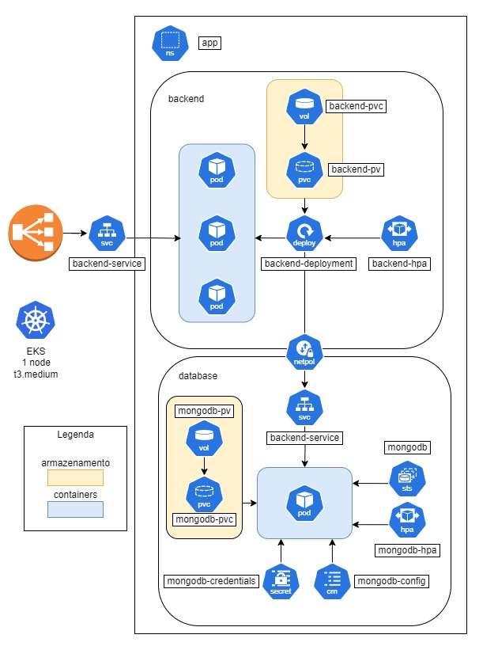

  

<h3 align="center">
    
Software Architecture

</h3>
<h3 align="center">
    
Grupo 9

</h3>

<h3 align="center">
    
API de Gestão de Pedidos de Restaurante

</h3>

Clean Architecture e Kubernetes

### Tópicos
=================
   * [Descrição do projeto](#descrição-do-projeto)
   * [Objetivo](#objetivo)
   * [Entregáveis do projeto](#entregáveis-do-projeto)
   * [Requisitos funcionais](#requisitos-funcionais)
   * [Tecnologias](#tecnologias)
      * [Tecnologias utilizadas no projeto](#tecnologias-utilizadas-no-projeto)
   * [Serviços](#serviços)
   * [Getting started](#getting-started)
      * [Dependências de Produção](#dependências-de-produção)
      * [Dependências de desenvolvimetno](#dependências-de-desenvolvimento)
   * [Execute a aplicação](#execute-a-aplicação)
      * [Docker](#docker)
   * [Execute os teste](#execute-os-testes)

### Descrição do projeto

Este projeto engloba o design da arquitetura, a criação da API e o seu deployment utilizando containers e orquestradores, visando proporcionar a um restaurante a possibilidade de gerir seus pedidos de lanches. Ele foi desenvolvido como parte de um trabalho de conclusão para obtenção do título de especialização em Arquitetura de Software. A API permite a criação, atualização, visualização e cancelamento de pedidos e foi projetada para ser robusta, escalável e de fácil manutenção.

### Objetivo

O objetivo deste projeto é demonstrar a aplicação prática dos princípios e padrões de Arquitetura de Software na criação e deployment de uma API de gestão de pedidos de um restaurante. Visa melhorar a eficiência operacional e a experiência do cliente ao gerenciar pedidos.

### Entregáveis do projeto

#### O entregável 1

É composto pela documentação do sistema, seguindo o modelo DDD, abordando os fluxos de realização do pedido, pagamento e preparação de entrega. No modelo DDD, devem ser documentadas as ações a serem realizadas pelo sistema, obtidas por meio de sessões de Brainstorming do time, diagrama de linha do tempo das ações, diagrama de contextos delimitados e glossário de linguagem ubíqua.

#### O entregável 2

Este entregável abrange a refatoração do código elaborado na fase 1, criação das novas APIs, implementação da arquitetura em Kubernetes e a disponibilização de documentação para facilitar a execução e compreensão do projeto.

### Requisitos funcionais

#### Arquitetura Kubernetes
Arquitetura dos recursos utilizados para a hospedagem do projeto, atendendo os requisitos de infraestrutura para escalabilidade da aplicação. Foi utiliza a solução EKS da AWS:

  

Vídeo de demonstração da arquitetura: https://www.youtube.com/watch?v=vBWGeD4QASE

Endpoint para acessar a aplicação: http://a3ab51859a0754518af906af3da1274e-2042224407.us-east-1.elb.amazonaws.com

#### Identificação e autenticação
##### Autenticação do usuário
Os usuários devem ser capazes de se autenticarem no sistema através de usuário e senha.

##### Cadastros de cliente
Os usuários devem ser capazes de se cadastrar fornecendo nome, e-mail e CPF.

#### Pedido
##### Listagem de produto
Os usuários devem ser capazes de consultar os produtos que se encontram cadastrados.

##### Criação de pedido
Os usuários devem ser capazes de criar pedidos com os produtos cadastrados.

##### Alteração de pedido
Os usuários devem ser capazes de alterar os produtos do pedido.

##### Cancelamento de pedido
Os usuários devem ser capazes de cancelar o pedido, desde que o pagamento não tenha sido confirmado.

#### Preparação
##### Listagem dos pedidos na fila
Os usuários funcionários devem ser capazes de listar os pedidos criados.

##### Manutenção do pedido na fila
Os usuários funcionários devem ser capazes de alterar o status do pedido na fila.

###  Tecnologias 

#### Tecnologias utilizadas no projeto

* node                      18.16.0
* npm                       9.5.1
* docker                    23.0.5
* kubernetes                1.28.5
* terraform aws provider    4.67.0

###  Serviços

* Github
* AWS EKS

###  Getting started

#### Dependências de Produção
  - bcrypt        5.1.1
  - cli-color     2.0.3
  - express       4.18.2
  - fast-glob     3.3.2
  - jsonwebtoken  9.0.2
  - mongodb       6.3.0
  - validator     13.11.0

#### Dependências de Desenvolvimento
  - jest          29.7.0
  - supertest     6.3.3
  - mockdate      3.0.5
  - husky         8.3.0
  - lint-staged   15.2.0
  - rimraf        5.0.5
  - ts-jest       29.1.1
  - ts-node       10.9.2
  - typescript    5.3.3
  - module-alias  2.2.3
  - eslint                      7.32.0 || 8.2.0
    - eslint-config-airbnb-base 15.0.0
    - eslint-plugin-import      2.25.2
  - jest                        28.1.0

#### Dependências de Infraestrutura
  - kubectl       1.29.1
  - terraform     1.7.3
  - awscli        2.15.20
  
###  Execute a aplicação

#### Docker
    - npm run up:locally - Realiza o build da imagem antes de executar
    - npm run up - Apenas executa a aplicação em Docker
    
### Execute os testes
    - npm run test - Executa todos os testes
    - npm run test:unit - Executa testes unitários
    - npm run test:integration - Executa testes de integração

### Rotas

### Health
  - [GET] Health Check - Verifica a saúde da API

#### Login
  - [POST]  SignUp - Versão do cliente
  - [POST]  SignUp - Versão do administrador
  - [POST]  Login
  - [POST]  Logout

#### Accounts
  - [GET] Consulta registro por CPF

#### Products
  - [GET] Consulta Produtos
    - Retorna todos os produtos cadastrados
    - Habilitado para uso de query params
  - [POST]  [ADMIN] Criação de Produto
  - [PATCH] [ADMIN] Atualiza Produto
  - [DELETE]  [ADMIN] Deleta Produto

#### Orders
  - [GET] Consulta Pedidos
    - Retorna todos os pedidos realizados
    - Habilitado para uso de query params
  - [POST]  Cria Pedido
  - [PATCH] Atualiza Pedido
